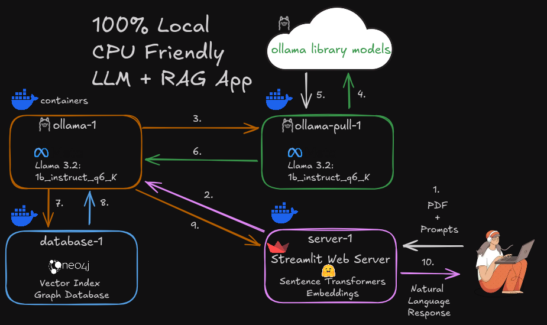

# docker-genai-sample

A simple GenAI app for [Docker's Guides Docs](https://docs.docker.com/guides/genai-pdf-bot/) based on the [GenAI Stack](https://github.com/docker/genai-stack) PDF Reader application. 

See the Ollama Environment Variables in the env.demo file and adjust them accoring to your needs

 

1. User sends PDF & prompts to the server-1 container
2. Server splits, chunks, embeds & sends PDF + prompts to ollama-1 container
3. Ollama-1 checks for the model listed in .env file, if not available it requests it from ollama-pull-1
4. Ollama-pull-1 will request the model from the Ollama models library 
5. It pulls (downloads) the model 
6. Ollama-pull-1 then stores it in the Ollama-1 container and shuts down
7. Ollama-1 uses the model to perform a vector search in the Neo4j database-1 container
8. Database-1 retrieves the relative embeddings and returns them to ollama-1
9. Ollama-1 returns the response embeddings w/ the relative PDF segments 
10. Server-1 turns the embeddings back into Natural Language the user can understand